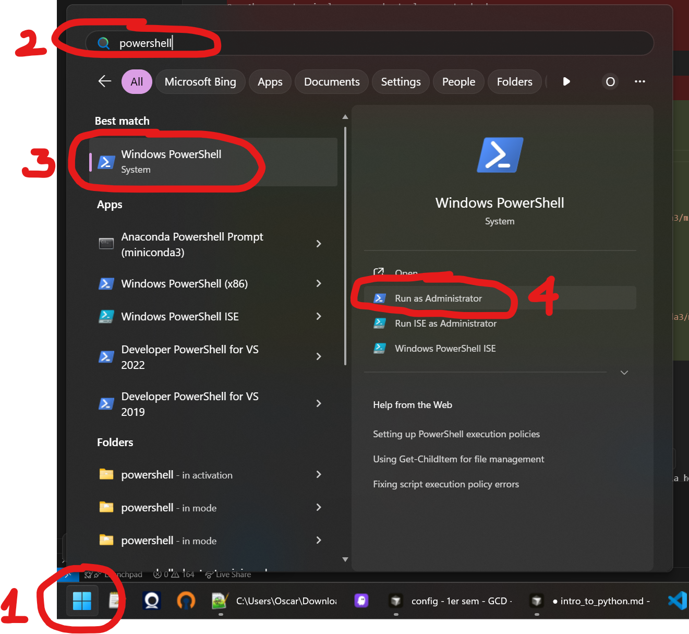
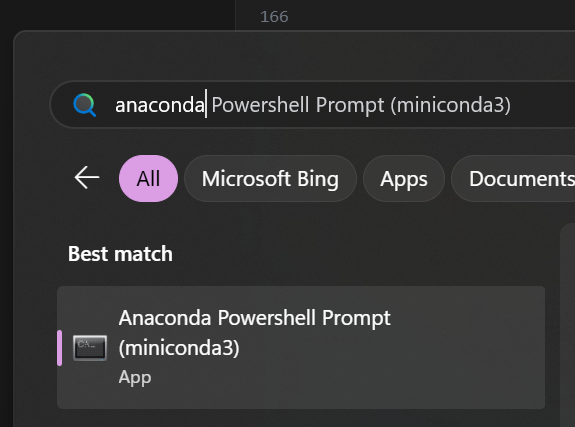
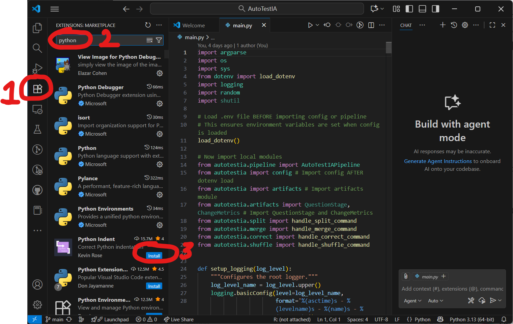
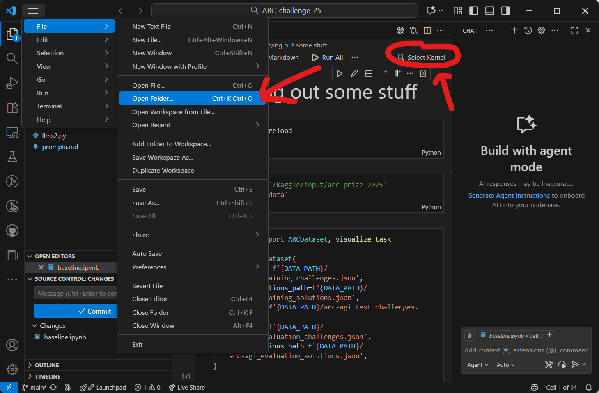

<!-- Course logo -->
<style> section::before{ background: url("logos/uv_isp.png") no-repeat center/contain; } </style>

<!-- _class: small no-footer -->


<br>


# Introducción a Python

### Máster en Sociedad Digital

Oscar José Pellicer Valero
`Oscar.Pellicer@uv.es`

Departament d’Enginyeria Electrònica
Escola Tècnica Superior d’Enginyeria

---

<!-- _class: smaller -->

## Programa del curso: Introducción a Python


<div class="columns">
<div>

**Horario:** Viernes de 15:30h a 18:30h
**Requisitos:** Trae tu propio portátil!
**Sesiones:**

- **Sesión 1 (Viernes, 7 de noviembre): Gramática básica de Python.** Familiarización con el entorno de Jupyter Notebooks y aprendizaje de los conceptos fundamentales de Python, incluyendo la introducción a variables para almacenar información y cómo trabajar con datos de texto.
- **Sesión 2 (Viernes, 14 de noviembre): Estructura de datos y automatización de tareas.** Se aborda la organización de la información en colecciones como listas y diccionarios, junto con la automatización de tareas repetitivas mediante bucles y la toma de decisiones con sentencias condicionales.

</div>
<div>

- **Sesión 3 (Viernes, 21 de noviembre): Introducción al análisis de datos con Pandas.** Esta sesión se centra en Pandas, la librería más importante para la ciencia de datos en Python, cubriendo la carga, inspección y filtrado de un conjunto de datos del mundo real.
- **Sesión 4 (Viernes, 5 de diciembre): Manipulación y visualización de datos con Seaborn.** Se enseñan técnicas para transformar datos y responder preguntas complejas usando agrupaciones, así como la creación de visualizaciones y gráficos profesionales con la librería Seaborn.
- **Sesión 5 (Viernes, 12 de diciembre): Machine learning y proyecto final.** Introducción a los conceptos de "machine learning" mediante la construcción de un modelo predictivo simple. Se consolidan todas las habilidades aprendidas con un proyecto final de análisis de datos.

</div>
</div>

---

<!-- _class: no-footer -->


# Introducción a `conda`, `mamba`, `venv`

*Prompt: A toolbox for data scientists, data all over the place*

---

<!-- _class: smaller -->

## 0. Desinstalando Anaconda

Si ya tienes instalada una versión de Anaconda, para evitar conflictos, es muy recomendable desinstalarla por completo antes de empezar:

<div class="columns">
<div>

**Windows:**

1.  **Usar el desinstalador:** Busca "Agregar o quitar programas", encuentra Anaconda en la lista y haz clic en "Desinstalar". En la carpeta de instalación de Anaconda (ej. `C:\Users\username\Anaconda3`) suele haber un `Uninstall-Anaconda3.exe`.
2.  **Limpieza manual:** Después de desinstalar, borra las carpetas residuales como `.conda` y `.continuum` en tu directorio de usuario (`C:\Users\username`).

</div>
<div>

**macOS / Linux:**

1.  **Eliminar la carpeta de instalación:** Abre una terminal y elimina el directorio de Anaconda: `rm -rf ~/anaconda3` (la ruta puede variar, p.ej., `~/opt/anaconda3`).
2.  **Limpiar archivos de configuración:** Elimina las carpetas y archivos de configuración ocultos en tu directorio de inicio: `rm -rf ~/.condarc ~/.conda ~/.continuum`.
3.  **Editar el perfil del shell:** Abre tu archivo de configuración del shell (p.ej., `~/.bashrc`, `~/.zshrc`) y elimina la línea que añade Anaconda a tu `PATH`.

</div>
</div>

 **Anaconda-Clean:** Para una limpieza más profunda, puedes instalar `anaconda-clean` desde el Anaconda Prompt antes de desinstalar: `conda install anaconda-clean` y luego ejecutar `anaconda-clean --yes`.

---

<!-- _class: smaller -->

<!--  -->


## 1. Instalando Miniconda

Miniconda es una versión mínima de Anaconda que incluye solo Python, `conda` y un pequeño número de paquetes. Esto nos da un mayor control sobre nuestros entornos. 

A continuación se muestran los comandos para instalarlo, pero para más información puedes consultar la [guía oficial](https://www.anaconda.com/docs/getting-started/miniconda/install#quickstart-install-instructions).

**Windows**

En Windows, abrimos PowerShell como Administrador (ver imagen de la derecha $\rightarrow$).

A continuación, ejecutamos los siguientes comandos:

<br>

```powershell
Invoke-WebRequest -Uri "https://repo.anaconda.com/miniconda/Miniconda3-latest-Windows-x86_64.exe" -outfile ".\miniconda.exe"
Start-Process -FilePath ".\miniconda.exe" -ArgumentList "/S" -Wait
del .\miniconda.exe
```

---

<!-- _class: smallest -->

## Instalando Miniconda (continuación)

**Linux**: Hacemos `Ctrl + Alt + T` para abrir una terminal y ejecutamos los siguientes comandos:
```bash
mkdir -p ~/miniconda3
wget https://repo.anaconda.com/miniconda/Miniconda3-latest-Linux-x86_64.sh -O ~/miniconda3/miniconda.sh
bash ~/miniconda3/miniconda.sh -b -u -p ~/miniconda3
rm ~/miniconda3/miniconda.sh
```

**macOS**: Hacemos `Command + Space` para abrir el Spotlight y buscamos "Terminal", luego ejecutamos los siguientes comandos:

**macOS (Apple Silicon)**
```bash
mkdir -p ~/miniconda3
curl https://repo.anaconda.com/miniconda/Miniconda3-latest-MacOSX-arm64.sh -o ~/miniconda3/miniconda.sh
bash ~/miniconda3/miniconda.sh -b -u -p ~/miniconda3
rm ~/miniconda3/miniconda.sh
```
**macOS (Intel)**
```bash
mkdir -p ~/miniconda3
curl https://repo.anaconda.com/miniconda/Miniconda3-latest-MacOSX-x86_64.sh -o ~/miniconda3/miniconda.sh
bash ~/miniconda3/miniconda.sh -b -u -p ~/miniconda3
rm ~/miniconda3/miniconda.sh
```

---

<!-- _class: small -->

## Potenciando `conda` con `mamba`

<!--  -->


Mamba es un reimplementación de `conda` en C++ que es mucho más rápida, especialmente a la hora de resolver dependencias complejas.

Una vez instalado Miniconda, abre el **Anaconda Prompt (Windows)** (ver imagen de la derecha $\rightarrow$) o tu **terminal (macOS/Linux)** y ejecuta:

```bash
conda install -n base -c conda-forge mamba
```

<div class="info">

A partir de ahora, para la mayoría de los comandos, puedes usar `mamba` en lugar de `conda` para una experiencia mucho más fluida y rápida.

</div>

---

<!-- _class: smaller -->

## Comandos básicos de `conda` / `mamba`

<div class="columns">
<div>

**Gestión de entornos:**

*   Crear un entorno:
    ```bash
    conda create --name mi_entorno python=3.10
    ```
*   Activar un entorno:
    ```bash
    conda activate mi_entorno
    ```
*   Desactivar el entorno actual:
    ```bash
    conda deactivate
    ```
*   Listar todos los entornos:
    ```bash
    conda env list
    ```
*   Eliminar un entorno:
    ```bash
    conda env remove --name mi_entorno
    ```

</div>
<div>

**Gestión de paquetes:**

*   Instalar paquetes:
    ```bash
    mamba install numpy pandas scikit-learn
    ```
*   Instalar desde un canal específico:
    ```bash
    mamba install -c conda-forge nombre_paquete
    ```
*   Listar paquetes instalados en el entorno activo:
    ```bash
    mamba list
    ```
*   Eliminar un paquete:
    ```bash
    mamba remove nombre_paquete
    ```
*   Exportar un entorno a un archivo y crearlo desde él:
    ```bash
    mamba env export > entorno.yml
    mamba env create -f entorno.yml
    ```
</div>
</div>

---

<!-- _class: small -->

## Creando un entorno para Ciencia de Datos

Vamos a crear un entorno llamado `datascience` con las librerías esenciales.

1.  **Abre tu terminal (macOS/Linux) o Anaconda Prompt (Windows).**

2.  **Crea el entorno instalando los paquetes directamente:**

    ```bash
    conda create -n datascience python=3.10 numpy pandas matplotlib scikit-learn jupyterlab
    ```

    *   `conda create -n datascience`: Crea un nuevo entorno llamado `datascience`.
    *   `python=3.10`: Especifica la versión de Python.
    *   `numpy pandas ...`: Lista de paquetes a instalar.

3.  **Activa el nuevo entorno:**

    ```bash
    conda activate datascience
    ```

    Tu terminal cambiará para mostrar `(datascience)`, indicando que el entorno está activo.

---

<!-- _class: small -->

## Instalando Visual Studio Code

Visual Studio Code (VS Code) es un editor de código ligero y potente que usaremos como nuestra herramienta principal para trabajar con Python y Jupyter Notebooks.

1.  **Descarga e instala VS Code:**
    Ve a la [web oficial de VS Code](https://code.visualstudio.com/) y descarga el instalador para tu sistema operativo. Sigue las instrucciones de instalación.

2.  **Instala las extensiones esenciales:**
    Una vez abierto VS Code, ve a la pestaña de Extensiones (el icono de los cubos en la barra lateral) y busca e instala las siguientes extensiones de Microsoft (ver siguiente slide):
    *   **Python:** Soporte para el lenguaje Python (linting, debugging, etc.).
    *   **Jupyter:** Soporte para trabajar con Jupyter Notebooks.

---


    
---

<!-- _class: smaller -->

## Usando Jupyter Notebooks en VS Code

1.  **Abre la carpeta de tu proyecto en VS Code**
    Puedes usar `File > Open Folder...` o arrastrar la carpeta directamente a la ventana de VS Code.

2.  **Crea o abre un Jupyter Notebook**
    *   Para crear uno nuevo, puedes usar el atajo `Ctrl+Shift+P` para abrir la paleta de comandos, escribir `Jupyter: Create New Jupyter Notebook` y presionar Enter.
    *   Si ya tienes un archivo `.ipynb`, simplemente haz doble clic sobre él en el explorador de archivos.

3.  **Selecciona el kernel correcto**
    En la esquina superior derecha del notebook, verás un botón para seleccionar el `kernel`. Haz clic en él y elige tu entorno de conda `datascience`. Si no aparece, puede que tengas que buscarlo haciendo clic en `Select Another Kernel...` y navegando hasta el ejecutable de Python de tu entorno.

Mira la imagen en la siguiente slide como referencia.

---



---

<!-- _class: smaller -->

## Potencia tu código con GitHub Copilot

GitHub Copilot es un asistente de programación basado en IA que se integra en VS Code y te ayuda a escribir código más rápido. Como estudiantes, podéis acceder a Copilot Pro de forma gratuita solicitando a Github acceso los *Education Benefits*.

1.  **Regístrate en GitHub:**
    Si no tienes una cuenta, regístrate en GitHub [aquí](https://github.com/join) usando tu correo electrónico académico. Si ya tienes una cuenta con un correo no académico, puedes añadir tu correo académico a tu cuenta [aquí](https://github.com/settings/emails).

2.  **Solicita acceso a los *Education Benefits*:**
    Ve a [esta página](https://github.com/settings/education/benefits) y sigue los pasos para solicitar acceso a los *Education Benefits*. Una vez aprobados, podrás acceder a Copilot Pro de forma gratuita.

3.  **Instala la extensión en VS Code:**
    *   Ve a la pestaña de Extensiones en VS Code.
    *   Busca `Github` y `GitHub Copilot` e instálalas.
    *   Inicia sesión con tu cuenta de GitHub desde VS Code cuando te lo pida para vincularla.

---


<!-- _class: smaller -->

## Alternativa a VS Code: Jupyter Lab

Si prefieres la interfaz clásica de Jupyter Lab en el navegador, puedes seguir estos pasos.

1.  **Instala Jupyter Lab en el entorno `base`:**  Jupyter Lab es una interfaz web interactiva. Lo instalaremos en el entorno `base` para que actúe como nuestro "lanzador" principal.
    ```bash
    mamba install -n base -c conda-forge jupyterlab
    ```

2.  **Conecta tu entorno `datascience`:** Por defecto, Jupyter Lab solo "ve" el Python del entorno desde el que se lanza. Para que pueda usar nuestro entorno `datascience`, necesitamos instalar `ipykernel` en él y registrarlo.
    
    *   **Activa el entorno `datascience`:** `conda activate datascience`
    *   **Instala `ipykernel`:** `mamba install ipykernel`
    *   **Registra el entorno como un kernel para Jupyter:** `python -m ipykernel install --user --name datascience --display-name "Python (datascience)"`
        
3.  **Lanza Jupyter Lab:**
    Asegúrate de estar en el entorno `base` (`conda deactivate` si estás en otro) y ejecuta: `jupyter lab`
    Esto abrirá Jupyter Lab en tu navegador, y ahora verás "Python (datascience)" como una opción para crear nuevos notebooks.

---


<!-- _class: smaller -->

## Alternativa a `conda`/`mamba`: `venv`

Python incluye su propio módulo para crear entornos virtuales ligeros, llamado `venv`.

<div class="columns">
<div>

**Creación y activación:**

1.  **Navega a la carpeta de tu proyecto.**
2.  **Crea el entorno:**
    ```bash
    python -m venv .venv
    ```
    (Se creará una carpeta `.venv` en tu directorio actual)
3.  **Activa el entorno:**
    *   **Windows:**
        ```bash
        .venv\Scripts\activate
        ```
    *   **macOS / Linux:**
        ```bash
        source .venv/bin/activate
        ```

</div>
<div>

**Gestión de paquetes:**

*   `venv` no gestiona paquetes. Se usa `pip`, el instalador de paquetes de Python.
*   **Instalar paquetes:**
    ```bash
    pip install numpy pandas
    ```
*   **Guardar dependencias:**
    ```bash
    pip freeze > requirements.txt
    ```
*   **Instalar desde un archivo:**
    ```bash
    pip install -r requirements.txt
    ```

</div>
</div>

---

<!-- _class: smaller -->

## `conda`/`mamba` vs. `venv`: Diferencias clave

<div class="columns">
<div>

### `conda` / `mamba`

*   **Gestor de paquetes Y de entornos.**
*   **Independiente del lenguaje:** Puede gestionar paquetes y dependencias de otros lenguajes (R, C++, etc.), no solo Python.
*   **Gestión de binarios:** Instala paquetes pre-compilados (binarios), lo que puede ser más rápido y evitar problemas de compilación, especialmente en Windows.
*   **Gestión de Python:** Puede instalar diferentes versiones de Python en diferentes entornos.
*   **Centralizado:** Los entornos se guardan en una carpeta central de Miniconda, no en la carpeta del proyecto.

</div>
<div>

### `venv`

*   **Solo gestor de entornos.** Para paquetes, se usa `pip`.
*   **Específico de Python:** Solo gestiona paquetes de Python.
*   **Instala desde "wheels" o fuentes:** `pip` instala paquetes binarios (wheels) o compila desde el código fuente si no hay un wheel disponible para tu sistema.
*   **Usa el Python con el que se creó:** El entorno usa la versión de Python del sistema que se usó para crearlo.
*   **Descentralizado:** El entorno se crea típicamente dentro de la carpeta del proyecto.

</div>
</div>

<div class="info">

**Recomendación:** Para este curso, usaremos **`conda` + `mamba`** por su robustez en el ecosistema de ciencia de datos.

</div>